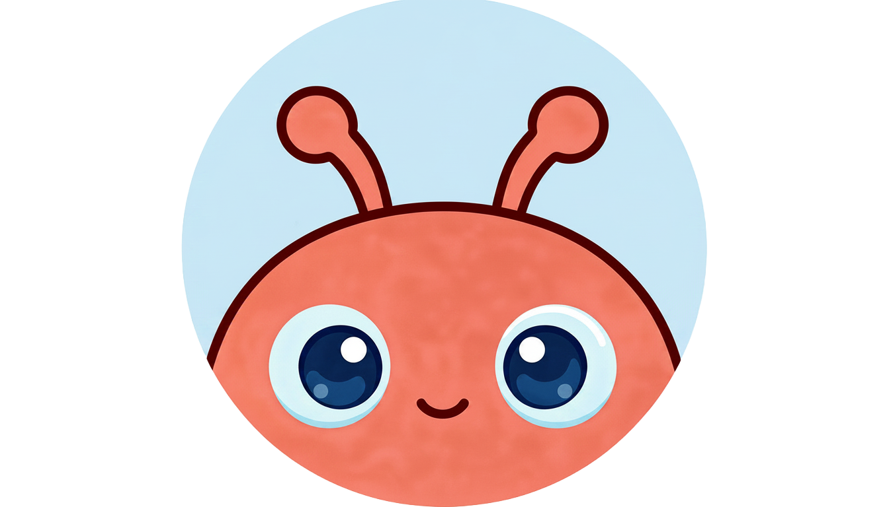
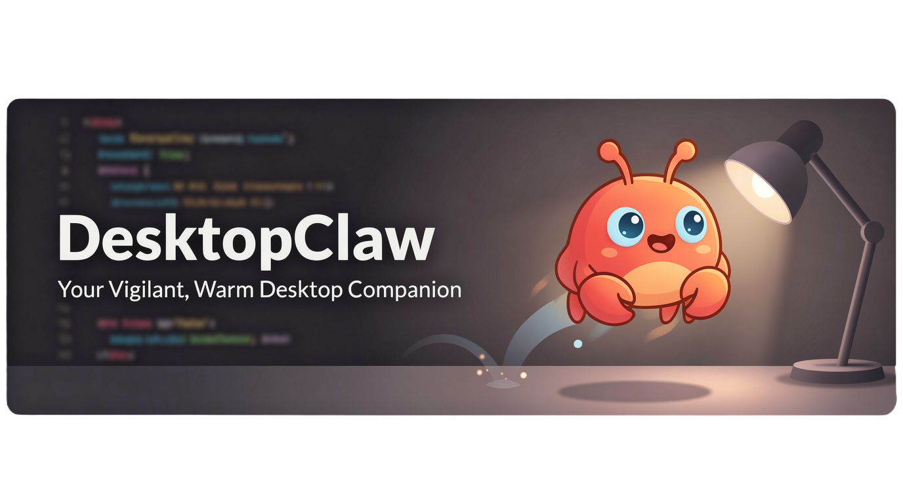
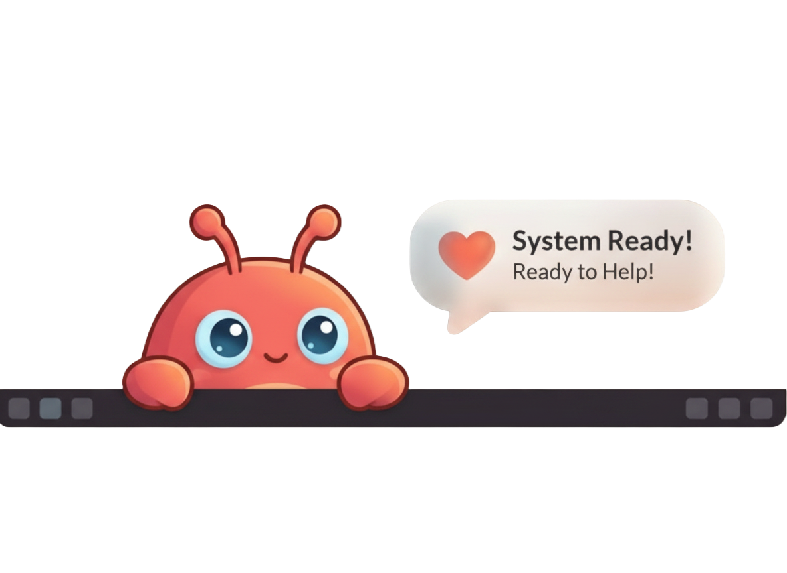

<a id="readme-top"></a>

[![CodeQL][codeql-shield]][codeql-url]
[![GitHub release][release-shield]][release-url]
[![GitHub issues][issues-shield]][issues-url]
[![License][license-shield]][license-url]

<br />

<div align="center">
  <a href="https://github.com/divbasson/DesktopClaw">
    
  </a>

  <h3 align="center">DesktopClaw</h3>

  <p align="center">
    A small Windows desktop avatar that gives OpenClaw a visible, voice-enabled presence.
    <br />
    <a href="RELEASE_NOTES.md"><strong>Read the release notes »</strong></a>
    <br />
    <br />
    <a href="https://github.com/divbasson/DesktopClaw/releases">Download Releases</a>
    &middot;
    <a href="https://github.com/divbasson/DesktopClaw/issues/new?labels=bug&template=bug_report.md">Report Bug</a>
    &middot;
    <a href="https://github.com/divbasson/DesktopClaw/issues/new?labels=enhancement&template=feature_request.md">Request Feature</a>
  </p>
</div>

<div align="center">
  
</div>

<details>
  <summary>Table of Contents</summary>
  <ol>
    <li>
      <a href="#about-the-project">About The Project</a>
      <ul>
        <li><a href="#built-with">Built With</a></li>
      </ul>
    </li>
    <li>
      <a href="#download">Download</a>
    </li>
    <li>
      <a href="#getting-started">Getting Started</a>
      <ul>
        <li><a href="#prerequisites">Prerequisites</a></li>
        <li><a href="#run-from-source">Run From Source</a></li>
      </ul>
    </li>
    <li><a href="#usage">Usage</a></li>
    <li><a href="#openclaw-gateway">OpenClaw Gateway</a></li>
    <li><a href="#voice-and-speech">Voice And Speech</a></li>
    <li><a href="#configuration">Configuration</a></li>
    <li><a href="#packaging">Packaging</a></li>
    <li><a href="#roadmap">Roadmap</a></li>
    <li><a href="#contributing">Contributing</a></li>
    <li><a href="#license">License</a></li>
  </ol>
</details>

## About The Project

<div align="center">
  
</div>

DesktopClaw is a transparent Electron desktop companion for OpenClaw. It sits on your Windows desktop as a small animated avatar, gives OpenClaw a visible presence, speaks useful responses back through local text-to-speech, and keeps request state clear while work is still running.

The goal is to make OpenClaw feel less like a background service and more like a present, responsive assistant. You can send a chat request, check gateway settings, change app options, or use the tray while the request continues. DesktopClaw keeps the active request alive and only removes the in-progress indicator when that specific request has a valid response.

What it does today:

- Connects to OpenClaw through a WebSocket gateway.
- Shows a draggable, transparent, always-on-top desktop avatar.
- Accepts typed prompts and push-to-talk voice input.
- Speaks responses with local Piper text-to-speech.
- Streams OpenClaw run progress into request-scoped thought bubbles.
- Handles long-lived OpenClaw sessions with interleaved user, tool, retry, and assistant messages.
- Lets you double-click the avatar to interrupt speech.
- Offers gateway status, model refresh, mute, visibility, settings, history, diagnostics, and quit actions from the system tray.
- Uses idle action sprites so the avatar can read, sleep, or work on a laptop when not actively busy.
- Supports optional idle click-through behavior.

<p align="right">(<a href="#readme-top">back to top</a>)</p>

### Built With

- [![Electron][electron-shield]][electron-url]
- [![Node.js][node-shield]][node-url]
- [![JavaScript][javascript-shield]][javascript-url]
- [Piper TTS][piper-url]
- [Vosk][vosk-url]
- [OpenClaw][openclaw-url]

<p align="right">(<a href="#readme-top">back to top</a>)</p>

## Download

Installer and standalone builds are available from the GitHub releases page:

<div align="center">
  <a href="https://github.com/divbasson/DesktopClaw/releases"><strong>Download DesktopClaw Releases »</strong></a>
</div>

Use the installer when you want DesktopClaw registered like a normal Windows app with shortcuts. Use the standalone/portable build when you want to try it without installing it system-wide.

Runtime settings are stored under the current Windows user profile, so packaged builds can preserve your gateway, voice, hotkey, and UI preferences between launches.

<p align="right">(<a href="#readme-top">back to top</a>)</p>

## Getting Started

Use the release installer or standalone build for normal use. Run from source when you are developing, testing local gateway behavior, or changing the avatar code.

### Prerequisites

- Windows.
- Node.js `20.x` or newer compatible with the Electron dependency set.
- An OpenClaw gateway reachable over WebSocket.
- Optional: Piper installed locally for speech output.
- Optional: Vosk model files under `models/` for native speech capture.

### Run From Source

```powershell
git clone https://github.com/divbasson/DesktopClaw.git
cd DesktopClaw
npm install
npm start
```

The app starts as a transparent desktop avatar. Hover or click the avatar to open the text input, or use the listen hotkey for voice input.

<p align="right">(<a href="#readme-top">back to top</a>)</p>

## Usage

DesktopClaw is designed to feel like a small companion rather than a static chat window.

- Click or hover near the avatar to bring up the text input.
- Type a request and press `Enter`.
- Use `Ctrl+Shift+Space` to bring DesktopClaw forward and focus the text box.
- Watch compact thought-bubble request indicators while OpenClaw is working.
- Continue using settings or the tray while a request is in progress.
- Double-click the avatar while it is speaking to stop the current spoken response.
- Use the tray menu for mute, visibility, settings, status checks, and model refresh.
- Leave it idle and the avatar will occasionally read, sleep, or work on a laptop.

Default hotkeys:

- Focus text input: `Ctrl+Shift+Space`
- Mute: `Ctrl+Shift+M`
- Show/hide: `Ctrl+Shift+H`
- Settings: `Ctrl+Shift+S`

<p align="right">(<a href="#readme-top">back to top</a>)</p>

## OpenClaw Gateway

DesktopClaw is primarily a WebSocket gateway client. The default settings point at a local OpenClaw gateway:

```json
{
  "gateway": {
    "mode": "gateway",
    "baseUrl": "ws://localhost:18789",
    "eventsUrl": "ws://localhost:18789",
    "sessionKey": "main",
    "timeoutMs": 30000
  }
}
```

The app talks to OpenClaw through gateway methods such as:

- `connect`
- `chat.send`
- `chat.history`
- `health` / `status`
- `sessions.list`
- `models.list`

OpenClaw sessions are long-lived and can contain messages from the desktop app, other chat surfaces, tool calls, retries, model errors, and final assistant replies. DesktopClaw correlates replies to the matching user request instead of assuming the whole session represents one job.

During an active request, DesktopClaw forwards OpenClaw run milestones to the renderer so the request indicator can show meaningful progress instead of a generic spinner. Late run events are ignored after a request reaches a terminal state, which prevents completed jobs from reappearing as active.

Model listing is supported through OpenClaw. Session model switching depends on backend support and may be unavailable on some gateway versions.

<p align="right">(<a href="#readme-top">back to top</a>)</p>

## Voice And Speech

DesktopClaw supports native voice input and local speech output:

- Voice input uses the native Vosk listener in `src/native/vosk_listener.py`.
- The global shortcut focuses the text input for fast typed interaction.
- Text-to-speech uses Piper when `tts.usePiperTts` is enabled.
- The default Piper voice path is configured as `tts.piperModel`.
- Double-click the avatar while it is speaking to stop the current spoken response.
- Emoji and pictographic symbols are stripped from the TTS path so they remain visible in the reply bubble without being spoken aloud.

Default Piper settings:

```json
{
  "tts": {
    "usePiperTts": true,
    "piperExe": "C:\\piper\\piper\\piper.exe",
    "piperModel": "F:\\DesktopClaw\\models\\piper\\voices\\cori-med.onnx"
  }
}
```

<p align="right">(<a href="#readme-top">back to top</a>)</p>

## Configuration

Default settings live in:

```text
settings.defaults.json
```

Runtime settings are written by Electron under the current user's app data folder:

```text
%APPDATA%\desktopclaw\settings.json
```

The settings panel can update gateway connection details, token/password values, hotkeys, click-through behavior, voice settings, and status polling options.

<p align="right">(<a href="#readme-top">back to top</a>)</p>

## Packaging

For an unpacked Windows build:

```powershell
npm run dist:dir
```

For installer and portable artifacts:

```powershell
npm run dist
```

Build output is written to `dist/`. Release artifacts include an installer and a standalone/portable build when produced through the Windows packaging flow.

<p align="right">(<a href="#readme-top">back to top</a>)</p>

## Roadmap

- [x] Transparent desktop avatar shell.
- [x] WebSocket OpenClaw gateway client.
- [x] Native Vosk push-to-talk capture.
- [x] Piper text-to-speech playback.
- [x] Request-scoped thought-bubble job indicators.
- [x] Speech interruption by double-clicking the avatar.
- [x] OpenClaw run-progress streaming into the renderer.
- [x] Mood/presence styling for listening, thinking, speaking, success, and error states.
- [x] Idle action sprites for reading, sleeping, and laptop work.
- [x] Tray history and diagnostics panels.
- [ ] Stronger packaged-app smoke tests for installer and standalone artifacts.
- [ ] Deeper visual QA around transparent-window edge cases.
- [ ] More polished first-run gateway pairing flow.
- [ ] Better in-app model/backend capability messaging.

See the [open issues][issues-url] for tracked bugs and feature requests.

<p align="right">(<a href="#readme-top">back to top</a>)</p>

## Contributing

Issues and pull requests are welcome. For useful reports, include:

- DesktopClaw version or commit.
- Whether you used the installer, standalone build, or source checkout.
- OpenClaw gateway URL/mode, with secrets removed.
- Relevant lines from `%APPDATA%\desktopclaw\logs\desktopclaw-debug.log`.
- A short description of what you expected and what happened.

Please keep changes focused and verify behavior against a real OpenClaw gateway when the change touches messaging, sessions, voice, or packaging.

<p align="right">(<a href="#readme-top">back to top</a>)</p>

## License

Distributed under the MIT license declared in [package.json][license-url].

<p align="right">(<a href="#readme-top">back to top</a>)</p>

## Project Layout

```text
src/
  main/
    app-controller.js    Main orchestration and IPC
    config-store.js      Runtime config lifecycle
    logger.js            App log writer
    main.js              Electron entrypoint
    native-stt.js        Native Vosk speech capture wrapper
    native-tts.js        Piper synthesis wrapper
    openclaw-client.js   OpenClaw WebSocket gateway client
    preload.js           Safe renderer bridge
    shortcut-manager.js  Global hotkeys
    tray-manager.js      System tray menu
    ui-shell.js          Transparent Electron window
  renderer/
    animation_engine.js  Avatar animation state
    index.html           Avatar UI root
    openclaw_client.js   Renderer gateway adapter
    renderer.js          Avatar behavior composition
    styles.css           Visual styling and animation states
    tts_engine.js        Renderer speech playback controller
    ui_shell.js          Bubble/settings helpers
    wake_word.js         Wake/listen flow support
  shared/
    config.js            Config load/save helpers
```

## Development Notes

- Keep request UI scoped to individual requests. Do not use OpenClaw session lifetime to decide whether a request indicator should remain visible.
- Do not let progress events move a terminal request back into a working state.
- OpenClaw may write transient assistant errors before a valid retry response. The client should prefer the first usable assistant text that follows the matching user message.
- Settings changes should not close a gateway client that is still waiting for an active chat response.
- The transparent window is sensitive to blurred layers near its edges; avoid large blurred rectangles that can reveal window bounds.
- Idle action sprites should preserve the same visual scale and alpha baseline as `openclaw_agent_sprite.png`.
- The TTS path should clean screen-only symbols such as emoji without changing the visible response bubble.
- `npm run lint` is currently a placeholder script, so syntax checks and live gateway tests are still important.

---

<div align="center">
  
  <br/>
  <sub>DesktopClaw - an OpenClaw desktop companion</sub>
</div>

[codeql-shield]: https://github.com/divbasson/DesktopClaw/actions/workflows/github-code-scanning/codeql/badge.svg
[codeql-url]: https://github.com/divbasson/DesktopClaw/actions/workflows/github-code-scanning/codeql
[release-shield]: https://img.shields.io/github/v/release/divbasson/DesktopClaw?style=for-the-badge
[release-url]: https://github.com/divbasson/DesktopClaw/releases
[issues-shield]: https://img.shields.io/github/issues/divbasson/DesktopClaw.svg?style=for-the-badge
[issues-url]: https://github.com/divbasson/DesktopClaw/issues
[license-shield]: https://img.shields.io/badge/license-MIT-green?style=for-the-badge
[license-url]: https://github.com/divbasson/DesktopClaw/blob/main/package.json
[electron-shield]: https://img.shields.io/badge/Electron-191970?style=for-the-badge&logo=electron&logoColor=white
[electron-url]: https://www.electronjs.org/
[node-shield]: https://img.shields.io/badge/Node.js-339933?style=for-the-badge&logo=nodedotjs&logoColor=white
[node-url]: https://nodejs.org/
[javascript-shield]: https://img.shields.io/badge/JavaScript-F7DF1E?style=for-the-badge&logo=javascript&logoColor=000
[javascript-url]: https://developer.mozilla.org/en-US/docs/Web/JavaScript
[piper-url]: https://github.com/rhasspy/piper
[vosk-url]: https://alphacephei.com/vosk/
[openclaw-url]: https://github.com/divbasson/OpenClaw
